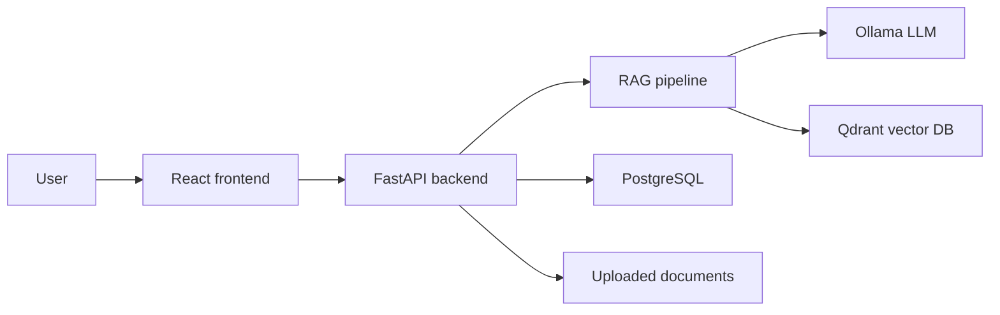

# Architecture

The application keeps the chat experience, document ingestion, and retrieval logic behind a service layer so a future WhatsApp, Telegram, or Teams adapter can reuse the same core pipeline.
